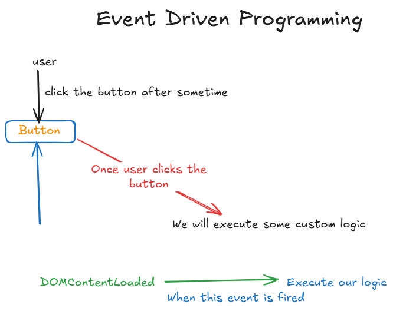

# Event Driven Programming

* A programming paradigm where code runs as a response to events, usually initiated by the user, and it is the dominant model in graphical user interfaces and web applications.
* In JavaScript, an event can be triggered by the user action e.g. clicking the mouse button, pressing a key, resizing a window, etc, or generated by APIs to represent the progress of an asynchronous task.
   